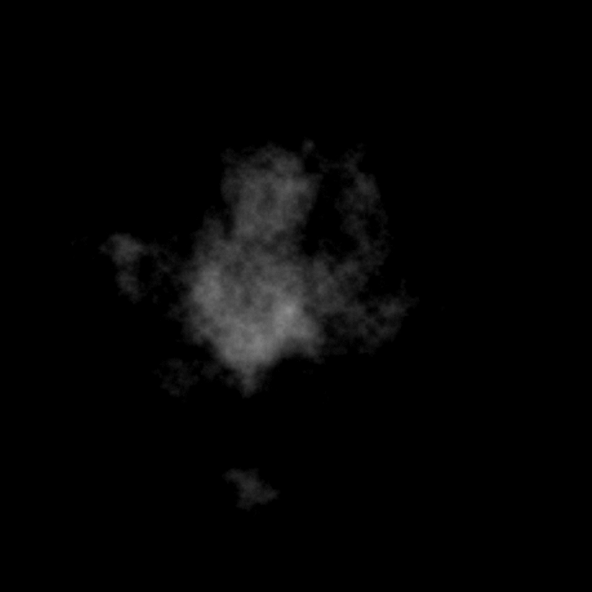
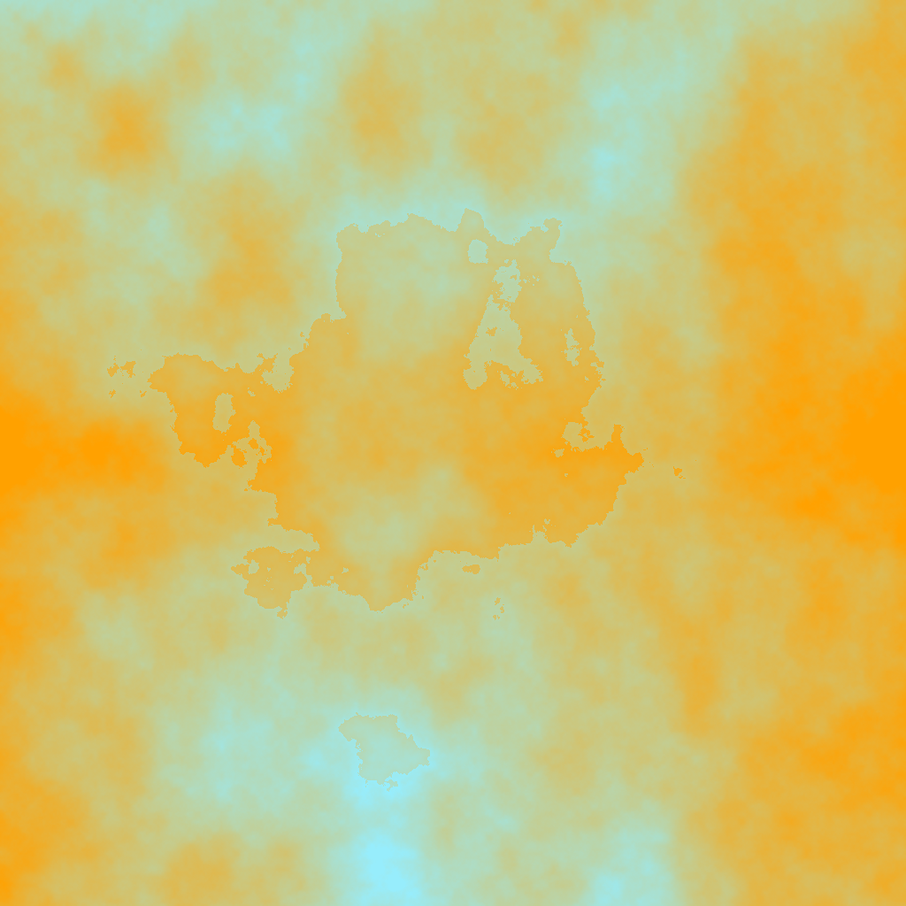
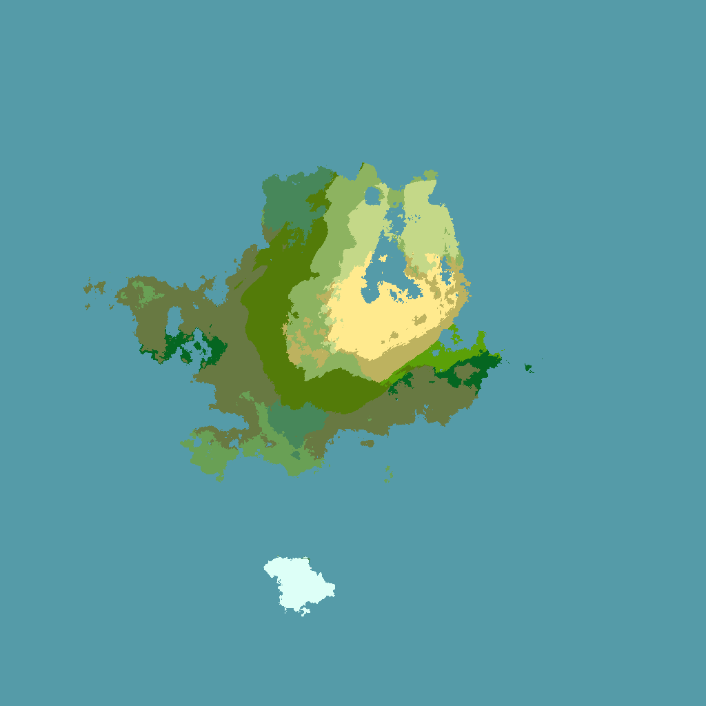
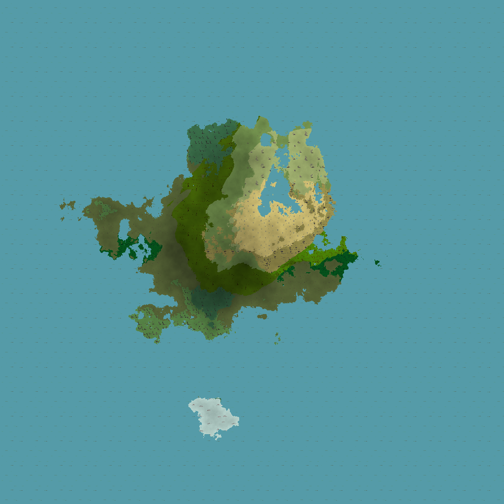

# Processing-WorldGeneration
Procedural World Generation using Processing and Java

Personal project capable of generating continents with a height, temperature, rainfall and biomes. 

Initially pure Processing was used (till version 4), however with version 5 the switch was made to a Java project using Processing as a library, this was done to increase flexibility by not being limited to the Processing IDE. 

## Setup
### Libraries
Version 5 needs 2 external libraries that have to be imported manually:
- **core.jar** The Processing library
- **controlP5.jar** The GUI library used together with Processing

These libraries can be obtained by downloading the latest Processing and installing the controlP5 plugin via the Processing IDE at the following paths respectively (assuming default install locations):
- \Program Files\processing-3.5.3\core\library\core.jar
- \User\\%userprofile%\Documents\Processing\libraries\controlP5\library\controlP5.jar

## Example Output

| v3 WorldGen Examples  | Click on image for full size |
| :---: | :---: |
|  Height Map |  Temperature Map |
|  Rain Map 1 |  Rain Map 2 |
|  Rain Map 3 |  Combined Rain Map |
|  Biome Map |  Textured End Result |
